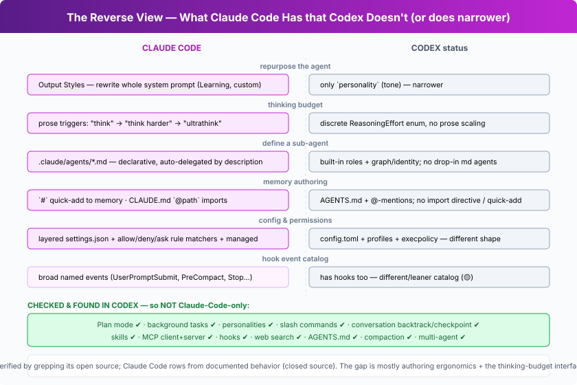

# The Reverse View — what Claude Code has that Codex doesn't

The rest of this repo is Codex-centric: it focuses on what Codex does *differently or more
than* Claude Code (CC). This page flips it: **mechanisms that exist in Claude Code but are
absent or narrower in Codex.**

> **How this was checked.** Codex is open source, so each "Codex status" below was verified
> by grepping the actual `codex-rs/` tree. Claude Code is closed source, so its rows come
> from documented/observable behavior. Honesty up front: **the two have converged hard.**
> Most of CC's edge is in *authoring ergonomics* and the *thinking-budget interface*, not in
> raw capability — and several things people assume are CC-only turned out to be in Codex
> (see the bottom list).

## The genuine deltas (CC → not in Codex, or narrower)

| # | Mechanism | What Claude Code does | Codex status | Confidence |
|---|---|---|---|---|
| 1 | **Output Styles** | Swap the *entire* system prompt to repurpose the agent (e.g. "Explanatory", "Learning", or a custom style that changes behavior wholesale — even into a non-coding assistant). | Has only **`personality`** (tone/persona). `output_style` appears **nowhere** in the source — so the full-repurposing mechanism is absent; personality is narrower. | Med-High |
| 2 | **Natural-language thinking budget** | Prose triggers scale reasoning tokens: `think` → `think hard` → `think harder` → `ultrathink`. | Uses a **discrete `ReasoningEffort` enum** (low/medium/high…). No prose-driven escalation (`ultrathink` not in source). Same goal, different interface. | High |
| 3 | **User-defined declarative subagents** | Drop a `.claude/agents/*.md` file (frontmatter + prompt); CC **auto-delegates** to it based on its `description`. | Agents are **built-in named roles** (`agent_names.txt`) plus a graph/identity orchestration system (L20/L22). No "drop-in markdown subagent, auto-selected by description" mechanism. | Medium |
| 4 | **Memory authoring affordances** | `#` at the start of a message **quick-adds** to memory; `CLAUDE.md` supports **`@path` imports** to compose memory files. | Has `AGENTS.md` + `@`-mentions of files/skills, but **no import directive and no `#` quick-add** were found. | Medium |
| 5 | **Layered settings + permission rules** | `settings.json` hierarchy (enterprise *managed* → user → project → local) with **allow/deny/ask rule matchers** per tool/command. | Uses **`config.toml` + profiles + `execpolicy`**. Capable, but a different shape — there's no settings.json rule-matcher model or managed-policy layering. | Medium |
| 6 | **Hook event catalog** | A broad, named lifecycle catalog (`UserPromptSubmit`, `PreToolUse`, `PostToolUse`, `PreCompact`, `SessionStart/End`, `Stop`, `SubagentStop`, `Notification`) configured in `settings.json`. | **Has hooks too** (`run_*_hook` in `turn.rs`) — but a leaner/different catalog, and they're not the primary safety gate (the sandbox is). This is 🟡 *different*, not absent. | Medium |

## Checked and found *in* Codex — so NOT Claude-Code-only

It would be easy (and wrong) to list these as CC exclusives. Verified present in `codex-rs/`:

- **Plan mode** — `ModeKind::Plan` is a real, TUI-visible collaboration mode.
- **Background tasks** — `BackgroundTerminalInfo`, background `unified_exec`.
- **Personalities** — `personality.rs`, `personality_migration.rs` (partial overlap with Output Styles).
- **Slash commands** — `docs/slash_commands.md`.
- **Conversation backtrack / checkpoint** — `tui/src/app_backtrack.rs`, a `Checkpoint` in `rollout-trace`.
- **Skills · MCP (client + server) · hooks · web search · AGENTS.md · compaction · multi-agent** — all present.

## So what's the honest summary?

- **Capability parity is high.** Both are full coding agents with tools, sandboxes (Codex
  deeper), MCP, hooks, skills, subagents, compaction, plan mode, and multiple surfaces.
- **CC's distinctive edge is ergonomic/interface-level:** Output Styles, the prose thinking
  budget, drop-in markdown subagents, and `settings.json`-style layered config + permission
  rules. These shape *how a user steers and configures the agent* more than *what it can do*.
- **Codex's distinctive edge is depth-level** (the rest of this repo): kernel-sandbox-first
  safety, `apply_patch`, code mode, the guardian reviewer, Rust single-binary, voice/cloud.

A neat symmetry: **Codex pushes the enforcement floor down into the kernel; Claude Code
pushes the configuration/steering surface up toward the user.**
