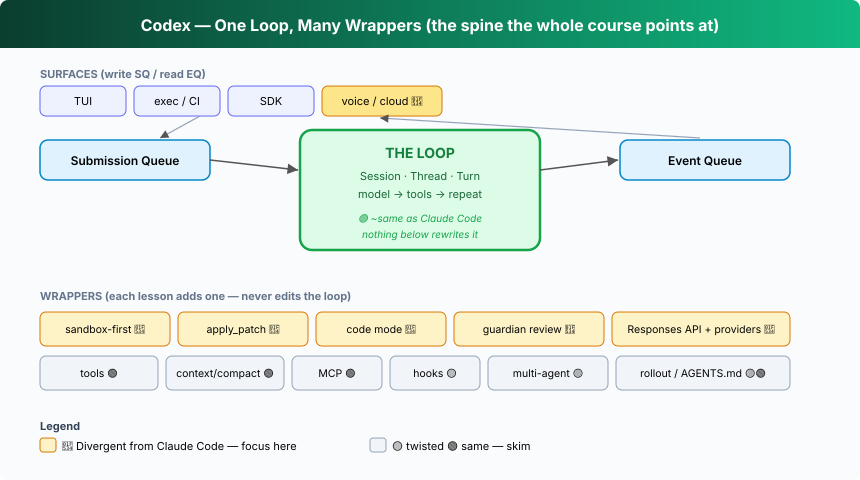
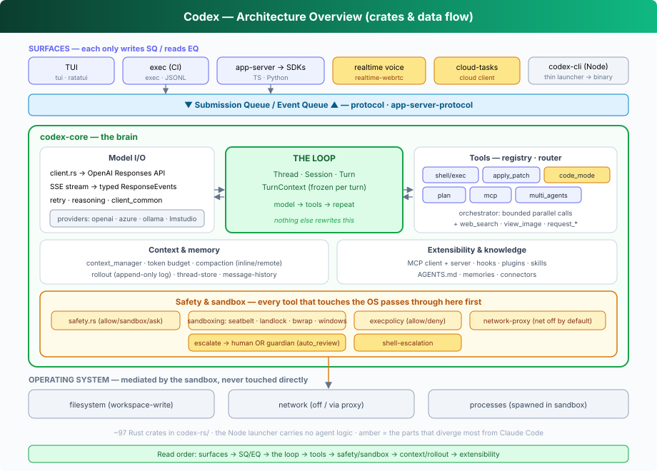

## L00 — Shape & process model 🔴

**Motto: *The language choice is an architecture choice.***

**Where to look:** top `README.md`, `codex-rs/` (97-crate Rust workspace), `codex-cli/bin/codex.js` (the launcher), `sdk/`, `docs/getting-started.md`.

**The mechanism.** Codex is a **single statically-linked Rust binary**. The npm package
`@openai/codex` (`codex-cli/`) is *only a launcher* that locates and execs the platform
binary — there is no agent logic in Node. The brain is the `core` crate; surfaces (`tui`,
`exec`, `app-server`) are thin.

**🔴 vs Claude Code.** This is the first real divergence and it ripples through everything:
- CC is a **Node/TypeScript** program; its agent logic *is* the JS process. Codex's agent
  logic is native code, and Node is disposable.
- Native code is *why* Codex can ship serious OS sandboxing (Stage 3): Seatbelt/Landlock/
  seccomp are kernel-level facilities far easier to drive from a single-process Rust binary
  than from a Node runtime that spawns child processes.
- Distribution differs: Codex ships per-platform binaries (and `brew install --cask`); CC
  ships an npm package. Codex even *self-invokes* its own binary for sub-tasks like
  `apply_patch` (see `CODEX_CORE_APPLY_PATCH_ARG1` in `apply-patch/src/lib.rs`).

The crate map you actually need (of ~97):

| Concern | Crate(s) | Divergence |
|---|---|---|
| Agent brain / loop | `core` | 🟢 |
| Wire protocol | `protocol`, `app-server-protocol` | 🟡 |
| Tools | `core/src/tools`, `apply-patch`, `code-mode`, `tools` | 🔴 |
| Sandbox | `sandboxing`, `linux-sandbox`, `windows-sandbox-rs`, `bwrap`, `execpolicy`, `network-proxy` | 🔴 |
| Safety review | `core/src/guardian`, `shell-escalation` | 🔴 |
| Persistence | `rollout`, `thread-store`, `message-history` | 🟡 |
| Extensibility | `mcp-server`, `rmcp-client`, `hooks`, `core-plugins`, `core-skills` | 🟢 |
| Surfaces | `tui`, `exec`, `app-server`, `realtime-webrtc`, `cloud-tasks` | mixed |

**The aha.** Before reading any agent, ask "what runs the loop, and in what language?" The
answer pre-decides which safety and performance designs are even available. Codex chose Rust
*so that* the kernel sandbox could be the default. CC chose Node *and therefore* leans on
approval prompts. Neither is wrong — but the language is upstream of the safety model.

---

## In this folder
