## L02 — Session · Thread · Turn · TurnContext 🟢

**Motto: *Separate what persists (thread) from what's happening now (turn).***

**Where to look:** `core/src/session/session.rs`, `session/turn.rs`, `session/turn_context.rs`, `codex_thread.rs`, `thread_manager.rs`.

**The mechanism.** **Thread** = durable conversation; **Session** = live runtime;
**Turn** = one input→answer cycle; **TurnContext** = the *immutable* per-turn settings
(cwd, sandbox/approval policy, model, instructions), frozen at turn start so mid-turn config
changes can't cause inconsistent decisions. The inner loop in `turn.rs` is the "untouched
loop."

**🟢 vs Claude Code.** Architecturally the same as CC's loop: a conversation that persists,
turns that run model→tools→repeat, and per-turn frozen settings. **Don't dwell.** The one
detail worth keeping: `TurnContext` immutability is what makes the safety decisions in
Stage 3 deterministic — the same idea exists in CC.

**The aha.** Snapshot policy at the turn boundary; never read mutable global config inside a
running loop.
