## L03 — Model client: Responses API, reasoning & providers 🔴

**Motto: *The wire format you target shapes the agent you can build.***

**Where to look:** `core/src/client.rs`, `client_common.rs`, `responses_retry.rs`, `stream_events_utils.rs`, `model-provider-info/`, `responses-api-proxy/`, `ollama/`, `lmstudio/`.

**The mechanism.** `client.rs` speaks OpenAI's **Responses API**, turning an SSE stream into
typed `ResponseEvent`s, with retry/backoff (`responses_retry.rs`) and a provider abstraction
(`model-provider-info`) that also targets Azure, OSS models, **ollama**, and **lmstudio**.

**🔴 vs Claude Code.** Same *job*, different *world*:
- **Responses API vs Messages API.** Codex is built around OpenAI's Responses API, whose
  first-class **reasoning items** and server-side state (e.g. remote compaction, L17) shape
  the design. CC targets Anthropic's **Messages API** with its own thinking/streaming model.
  The event types, the way reasoning is carried, and what the server remembers all differ.
- **Provider matrix differs.** Codex ships local-model paths (`ollama`, `lmstudio`) and a
  `responses-api-proxy`; CC's non-Anthropic story is Bedrock/Vertex. If you're porting ideas
  between them, the client layer is *not* swappable — it's the most API-coupled crate.

**The aha.** "Call the LLM" is provider-coupled. Quarantine it behind one client that emits
*your* normalized events, so the rest of the harness never learns whether it's talking to
Responses, Messages, or a local model.
