## L04 — Prompt assembly & base instructions 🟢

**Motto: *The system prompt is computed, not written.***

**Where to look:** `client_common.rs` (the `Prompt` type), `core/prompts/`, `core/src/agents_md.rs`, `session/turn.rs` (the `build_*_injections` calls).

**The mechanism.** Each turn assembles the model input from layers: base instructions +
project instructions (`AGENTS.md`) + active skills + tool specs + history. The prompt is a
*render target* fed by many injection sources.

**🟢 vs Claude Code.** Essentially identical to how CC composes its system prompt from base
rules + `CLAUDE.md` + skills + tools. **Don't dwell.** Only delta worth noting: Codex's
injection sources include MCP tool exposure and connector/plugin injections wired right into
`turn.rs`; CC has the same notion under different names.

**The aha.** Add capabilities by adding injection sources, never by editing a giant prompt
literal.
