## L05 — The tool registry & router 🟢



**Motto: *Tools are data; dispatch is a table lookup.***

**Where to look:** `core/src/tools/registry.rs`, `router.rs`, `mod.rs`, `handlers/mod.rs`, `tools/` crate (`ToolName`).

**The mechanism.** The registry holds specs; the router dispatches a model tool-call to a
handler. `ToolName` is a typed, namespaced value so builtin / MCP / dynamic tools coexist.
Which tools exist on a turn is dynamic (config, sandbox, MCP, skills).

**🟢 vs Claude Code.** Same pattern as CC's tool table. **Don't dwell** — both keep `match`
out of the loop and register `{spec, handler}` pairs.

**The aha.** Adding a tool must never touch the loop.

---

## In this folder

- **`code.py`** — runnable demo (offline, no deps):
  ```bash
  python3 lessons/s05_tool_registry/code.py
  ```
