## L06 — Shell & unified exec 🟡

**Motto: *Every dangerous capability funnels through one audited door.***

**Where to look:** `core/src/tools/handlers/shell/`, `handlers/unified_exec/`, `core/src/exec.rs`, `exec_env.rs`, `spawn.rs`, `command_canonicalization.rs`, `exec-server/`.

**The mechanism.** `unified_exec` is the single path for spawning processes: commands are
**canonicalized** (so `./x`, `x`, absolute paths resolve to one identity for policy),
run with a controlled environment, and **always launched inside the sandbox** (Stage 3).

**🟡 vs Claude Code.** Both funnel commands through one Bash/exec tool, so the *chokepoint*
idea is shared. The **twist** worth noting: Codex's `command_canonicalization` exists
specifically to feed the sandbox/exec-policy decision (L13) — canonicalization is a *safety*
input, not just hygiene. CC's Bash tool leans on permission-rule matching instead.

**The aha.** The chokepoint is where canonicalization, truncation, auditing, *and* the
sandbox entry all converge.
