## L09 — Parallel tool calls & the orchestrator 🟢

**Motto: *Run independent work concurrently; serialize what touches shared state.***

**Where to look:** `core/src/tools/orchestrator.rs`, `parallel.rs`, `lifecycle.rs`, `context.rs` (shared `TurnDiffTracker`).

**The mechanism.** A turn can request several tool calls; the orchestrator runs them with
bounded concurrency, the lifecycle layer emits begin/end events, and a shared diff tracker
merges parallel edits into one coherent diff.

**🟢 vs Claude Code.** CC also runs independent tool calls in parallel and serializes
stateful ones. **Don't dwell.** Same lesson: concurrency is a tool-layer concern kept out of
the loop.

**The aha.** The loop says "run these calls"; the orchestrator decides how.
