## L10 — The auxiliary tools 🟢

**Motto: *Some "tools" structure the conversation, not the world.***

**Where to look:** `core/src/tools/handlers/plan.rs`, `view_image.rs`, `web_search.rs`, `request_user_input.rs`, `request_permissions.rs`, `get_context_remaining.rs`, `tool_search.rs`, `sleep.rs`.

**The mechanism.** Several handlers don't touch the OS: **plan** (visible task list),
**request_user_input / request_permissions** (pause and ask — emit EQ events), **view_image
/ web_search** (pull context in), **get_context_remaining** (self-introspect budget),
**tool_search** (discover tools on demand).

**🟢 vs Claude Code.** Direct analogues: `plan` ≈ CC's `TodoWrite`; ask-the-user ≈ CC's
permission/question prompts; web/image ≈ CC equivalents. **Don't dwell.** Same insight: the
tool interface is the general extension point, including for human-in-the-loop and
self-inspection.

**The aha.** "Tool" generalizes to any structured interaction — even asking the human or
reasoning about your own limits.
