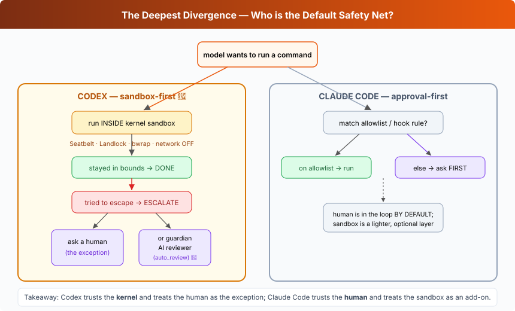

## L11 — Safety philosophy: sandbox-first vs approval-first 🔴



**Motto: *Decide allow / sandbox / ask — and pick which one is your default.***

**Where to look:** `core/src/safety.rs` (+ `safety_tests.rs`), `core/src/tools/sandboxing.rs`, `core/src/shell.rs`, `shell-escalation/`, `protocol/src/config_types.rs` (`SandboxMode`: `ReadOnly`, `DangerFullAccess`, …), `docs/sandbox.md` → OpenAI security docs.

**The mechanism.** Before any command runs, `safety.rs` classifies it against the active
**sandbox mode** and **approval policy** and returns one of: run **sandboxed**, run
**unsandboxed** (trusted), or **escalate** (pause, emit an approval request on the EQ). The
default stance is: *run it sandboxed with no network; if the sandbox blocks it and that looks
intentional, escalate and ask the human to re-run with more access.* The sandbox modes
(`ReadOnly` → `workspace-write` → `DangerFullAccess`) are named, coarse stances.

**🔴 vs Claude Code — the core contrast.**

| | Codex (sandbox-first) | Claude Code (approval-first) |
|---|---|---|
| Default before running a command | Run it **inside the sandbox**, network off | **Ask the user** (or match an allowlist rule) |
| When does a human get prompted? | On **sandbox escape / denial** (escalation) | **Before** the action, by default |
| Primary enforcement | The **OS kernel** (Seatbelt/Landlock) | **Permission rules + the user's judgment**; hooks can deny |
| "Trust me, go fast" mode | `DangerFullAccess` / bypass sandbox | `bypassPermissions` mode |
| Programmatic gatekeeper | exec-policy + guardian subagent (L15) | `PreToolUse` hooks returning deny |

Both can reach the same end state; they differ in *what is the safety net by default*. Codex
trusts the kernel and treats human approval as the exception; CC trusts the human (and hooks)
and treats the sandbox as an add-on.

**The aha.** "Is the human in the loop by default, or is the kernel?" is the single most
consequential decision in agent safety design — and Codex vs CC are the two canonical
answers. Everything else in this stage is Codex executing on "the kernel."

---

## In this folder

- **`code.py`** — runnable demo (offline, no deps):
  ```bash
  python3 lessons/s11_safety_philosophy/code.py
  ```
