## L14 — Approvals, escalation & permission profiles 🔴

**Motto: *Bundle dozens of safety knobs into a few nameable stances — and make "ask" a real return value.***

**Where to look:** `protocol/src/permissions.rs`, `protocol/src/models.rs` (`PermissionProfile`, `ActivePermissionProfile`, `SandboxEnforcement`), `protocol/src/config_types.rs` (`ModeKind`, `CollaborationMode`), `collaboration-mode-templates/`, `core/src/tools/handlers/request_permissions.rs`, `tui/src/collaboration_modes.rs`.

**The mechanism.** All the L11–L13 knobs collapse into **permission profiles** /
**collaboration modes** — named presets (read-only, workspace-write, full-access) selected in
the TUI and frozen into the `TurnContext`. The model can *request* an upgrade via
`request_permissions`, which the user grants/denies; an escalation pauses the turn and flows
through the same EQ as everything else.

**🔴/🟡 vs Claude Code.** Same *spirit* as CC's **permission modes** (`default`,
`acceptEdits`, `plan`, `bypassPermissions`) — both give users a few coherent stances instead
of twenty toggles. The **divergence** is what a mode *controls*: a Codex mode primarily sets
*sandbox + network + escalation* behavior (because the kernel is the enforcer); a CC mode
primarily sets *how eagerly it prompts you* (because you are the enforcer). Same UX idea,
opposite thing being configured.

**The aha.** Collapse your security surface into a few named stances, keep one active per
turn, and require an explicit, auditable request to change it.
