## L16 — Context manager & history 🟢

**Motto: *The history you send is a curated view, not the raw log.***

**Where to look:** `core/src/context_manager/` (`history.rs`, `normalize.rs`, `updates.rs`), `core/src/context/`, `session/token_budget.rs`, `message-history/`, `handlers/get_context_remaining.rs`.

**The mechanism.** Two histories: the **rollout** (full faithful record, L18) and the
**model-visible context** (normalized, token-budgeted projection rebuilt each turn). The
model can query remaining budget via a tool.

**🟢 vs Claude Code.** Same separation CC makes between its transcript and the budgeted
prompt context. **Don't dwell.**

**The aha.** Separate the *system of record* from the *model-visible projection* of it.
