## L17 — Compaction 🟢

**Motto: *When you run out of room, summarize the past instead of dropping it.***

**Where to look:** `core/src/compact.rs`, `compact_remote.rs`, `compact_remote_v2.rs`, `tasks/compact.rs`, `session/turn.rs` (`run_inline_auto_compact_task`), `protocol/src/compacted_item.rs`.

**The mechanism.** When the budget tightens, Codex runs a compaction task: summarize the
conversation, replace bulky history with summary + recent turns. It runs **inline** (local
turn) or **remote** (server-side), and triggers automatically mid-turn. The compacted item is
a first-class protocol object that survives in the rollout.

**🟡 vs Claude Code.** Same idea as CC's auto-compact and `/compact`. The small **twist**:
Codex has a **remote** compaction path (server-side, leaning on the Responses API's
server-held state from L03) in addition to the inline one — a consequence of its model API,
not a different philosophy. Otherwise, don't dwell.

**The aha.** A context window is a cache; compaction is summarize-then-evict.
