## L18 — Rollout & replayable sessions 🟡

**Motto: *Append every event to disk so any session can be replayed or resumed.***

**Where to look:** `rollout/`, `rollout-trace/`, `core/src/rollout.rs`, `session/rollout_reconstruction.rs`, `thread-store/`, `core/src/rollout_budget.rs`.

**The mechanism.** Every turn's items are appended to a **rollout** — a durable, ordered log
(the persisted EQ stream from L01). From it Codex *reconstructs* a thread: resume after a
crash, fork, or replay for debugging. Because protocol items are serializable, persistence is
mostly "write the stream to disk."

**🟡 vs Claude Code.** CC also persists sessions and supports `--resume`/`--continue`, so
resume itself is shared. The **delta**: Codex models this as explicit, structured
**event-sourcing** (a dedicated `rollout` crate + `rollout-trace` + reconstruction), which is
why fork/replay/trace fall out cleanly. CC's transcript persistence is more file-oriented.
Worth a skim to see event-sourcing done deliberately.

**The aha.** An append-only event log gives you crash recovery, resume, fork, audit, and
time-travel debugging for the price of serializing a stream you already had.
