## L19 — AGENTS.md, skills & memories 🟢

**Motto: *Persist instructions, not just facts — and match the store to the lifetime.***

**Where to look:** `core/src/agents_md.rs` (+ `docs/agents_md.md`), the repo's own `AGENTS.md`, `core-skills/` + `core/src/skills.rs` (+ `docs/skills.md`), `memories/` + `protocol/src/memory_citation.rs`.

**The mechanism.** Three durable-knowledge layers: **AGENTS.md** (project instructions
injected into the prompt), **skills** (packaged capabilities loaded on demand, paired with
`tool_search`), **memories** (durable facts the agent stores and later *cites*).

**🟢 vs Claude Code.** Near-direct mapping: **`AGENTS.md` ≈ `CLAUDE.md`**, Codex skills ≈ CC
skills, memories ≈ CC's memory. **Don't dwell** — the filename differs, the mechanism doesn't.
(Notably, `AGENTS.md` is becoming a cross-tool convention, so this is convergence, not
divergence.)

**The aha.** Durable knowledge has three lifetimes — per-project, per-capability, per-fact —
each deserving its own store and injection path.
