## L23 — The TUI 🟡

**Motto: *The UI is a stateful reader of the event stream.***

**Where to look:** `tui/` — `app.rs`, `chatwidget.rs`, `bottom_pane/`, `diff_render.rs`, `app_event.rs`, `app_backtrack.rs`, `approval_events.rs`.

**The mechanism.** A render loop over the EQ: stream tokens, render `apply_patch` diffs
(L07), surface approval prompts (Stage 3) as dialogs, turn keystrokes into Submissions. It
holds view state, not agent logic.

**🟡 vs Claude Code.** Both are thin terminal UIs over the event stream. The **delta** is
purely technological: Codex's TUI is **Rust + ratatui** (immediate-mode, in the same binary
as the engine); CC's is **Node + Ink/React**. Same architecture, different rendering stack —
a direct consequence of L00.

**The aha.** Keep zero agent logic in the view; a second surface then costs almost nothing.
