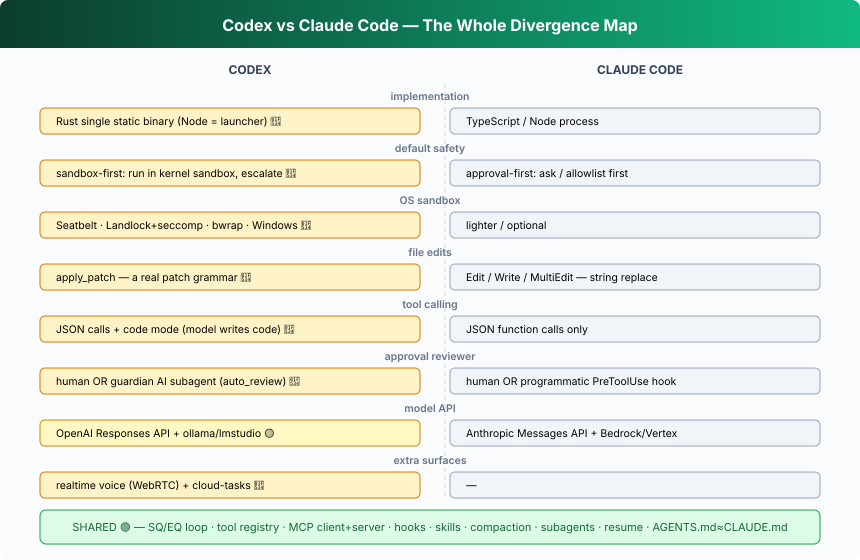

## L26 — One prompt, end to end + the divergence map 🔴

**Motto: *Trace one request through every layer, and watch where Codex and CC part ways.***

Follow a single "fix this bug" prompt and note each 🔴 fork:

1. **L01/L24** — a surface turns text into a **Submission** (🟢 same shape as CC).
2. **L02** — a **Turn** opens with a frozen **TurnContext** (🟢).
3. **L04** — prompt assembled from base + **AGENTS.md** (🟢, ≈ `CLAUDE.md`) + skills + tools.
4. **L03** — the **Responses API** client streams reasoning + tool calls (🔴 different API
   than CC's Messages).
5. **L05/L08** — router dispatches calls; the model may use **code mode** to script several
   tool calls at once (🔴 no CC equivalent).
6. **L07** — file changes arrive as one **apply_patch** blob (🔴 vs CC's `Edit`/`Write`).
7. **L11–L13** — *here is the big fork:* the command runs **inside Seatbelt/Landlock, network
   off, by default** (🔴). CC would typically **ask you first** instead.
8. **L14/L15** — only on a sandbox escape does it **escalate** — to the **human**, or to the
   **guardian AI reviewer** (🔴 vs CC's hook-based or human gate).
9. **L16/L17** — outputs grow history; **compaction** (incl. remote, 🟡) may fire mid-turn.
10. **L18** — every event is appended to the **rollout** (🟡 explicit event-sourcing);
    resumable.
11. Loop repeats until the model stops calling tools → **turn-complete** event → the surface
    (terminal, JSONL, SDK, or **voice**, 🔴) shows the answer.

**The aha — the course in two sentences.** *What's the same:* both Codex and Claude Code are
an untouched SQ→loop→EQ spine with tools, context management, MCP, hooks, subagents, and
multiple surfaces bolted on as wrappers — that architecture is settled, shared, and worth
learning once. *What's different, and why it matters:* Codex is a **Rust binary that defaults
to a kernel sandbox and edits via a patch grammar, can let the model program its tool use,
can delegate approvals to an AI reviewer, and reaches all the way to voice and cloud** — a
set of choices that all trace back to one stance, *"trust the kernel, not the prompt,"* and
one implementation decision, *"native, not Node."*

## Exercises (difference-focused)
- **Feel "sandbox-first":** run a command that writes outside the workspace under default
  settings and watch the escalation; compare to how CC would gate the same action.
- **Read two `.sbpl` files:** diff `seatbelt_base_policy.sbpl` vs `seatbelt_network_policy.sbpl`
  and write down exactly what each denies.
- **Trigger code mode:** find where tool schemas are rendered to TypeScript
  (`render_json_schema_to_typescript`) and trace one nested tool call through the runtime.
- **Compare edit protocols:** hand-write the same two-file change as (a) an `apply_patch`
  blob and (b) a sequence of CC `Edit` calls; note which fails more gracefully on a stale
  line number.
- **Find the guardian's prompt:** locate where `auto_review` builds its reviewer context in
  `core/src/guardian/` and decide what you'd trust it to auto-approve.

---

## In this folder
